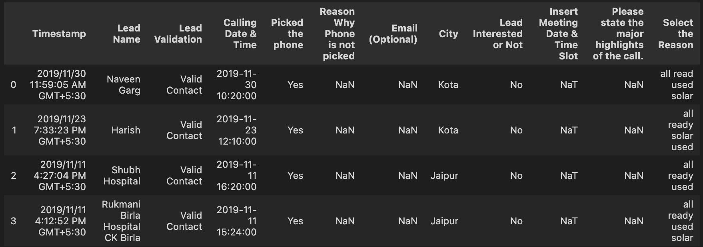
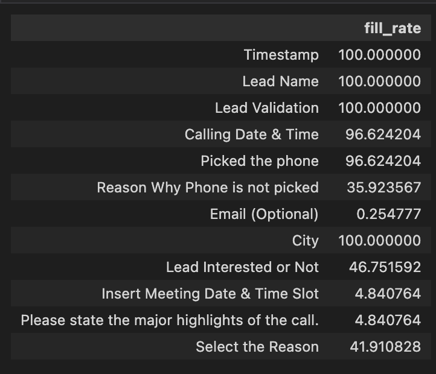
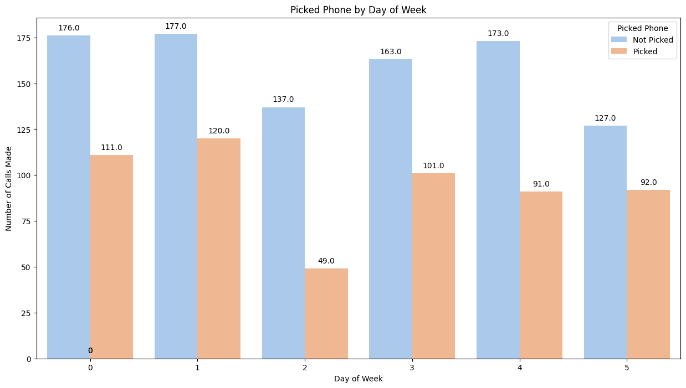
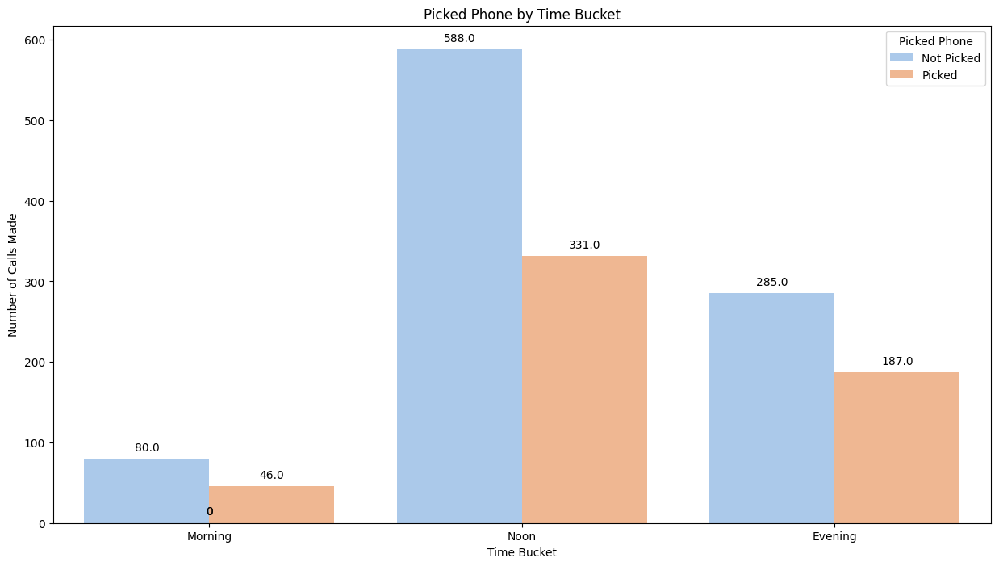
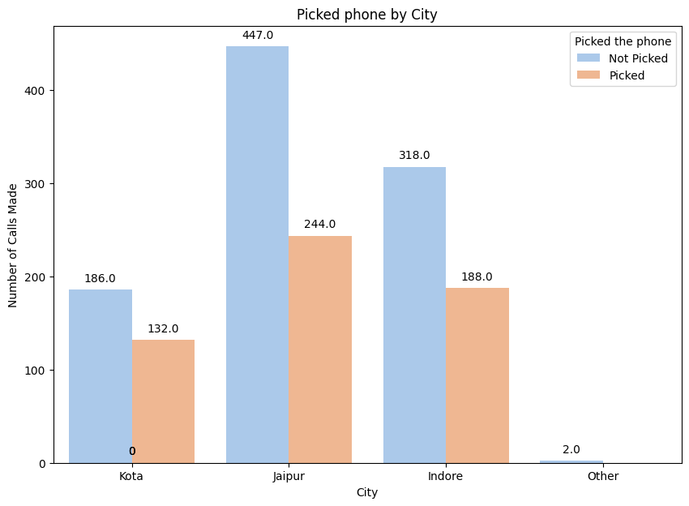
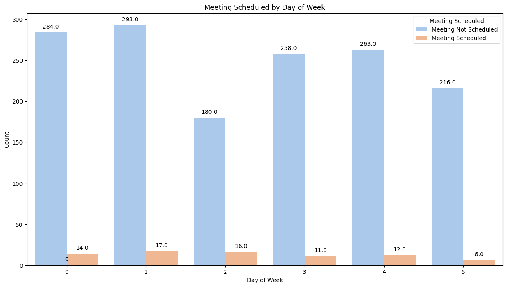
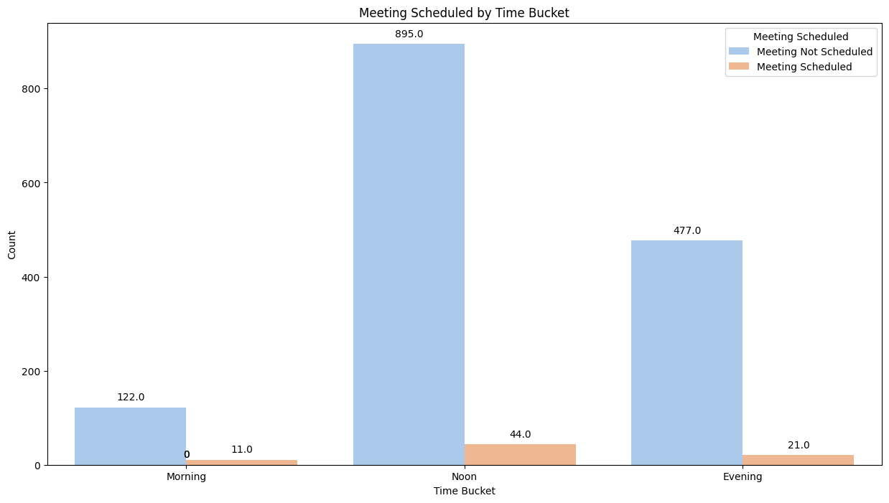
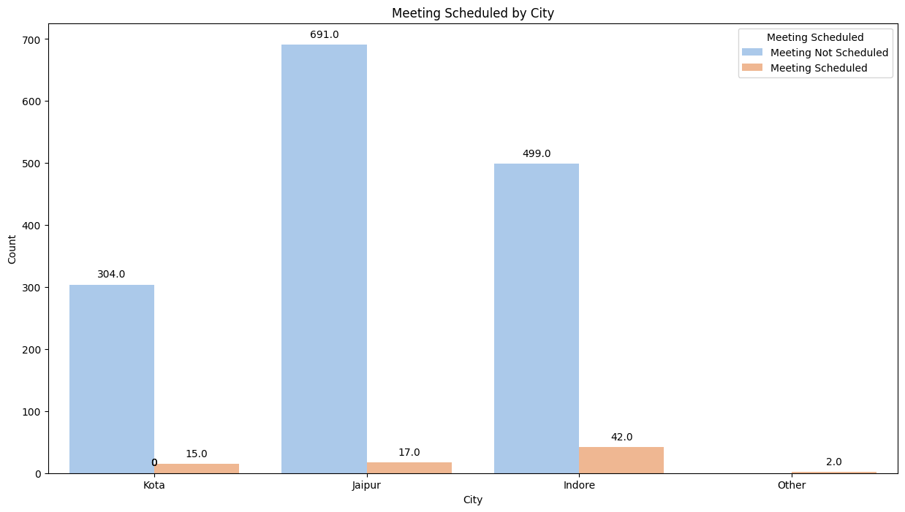

# LeadInsight Analyzer: Painting the Story of Lead Engagements

LeadInsight Analyzer is a comprehensive exploratory data analysis designed to unravel the intricacies of lead interactions within a dynamic business environment. Through a meticulous examination of a company dataset encompassing critical features such as timestamps, lead validation, call details, meeting schedules, and more, this project aims to provide actionable insights into the nuanced world of customer engagement.

## Objectives
1. **Call Conversion Rate to Meetings**:
Analyzing the dataset revealed the call conversion rate to meetings, providing valuable insights into the effectiveness of the communication strategy. This metric serves as a crucial indicator of lead progression through the sales funnel.

2. **Optimal Day and Time for Conversion**:
The exploration of calling date and time patterns unveiled the optimal days and times for contacting customers, maximizing the likelihood of successful conversions from calls to meetings. This information is instrumental in refining the timing of outreach efforts.

3. **Target City Identification**:
By examining the "City" feature, specific cities with higher response rates or potential for more leads were identified. This allows for strategic targeting and allocation of resources to regions with greater conversion opportunities.

4. **Lead Engagement Trends**:
Insights into the reasons for non-picked calls and the major highlights of successful calls provide a deeper understanding of lead engagement. This knowledge can be leveraged to enhance communication strategies and address common challenges in the conversion process.

Overall, these findings empower company with actionable intelligence to optimize its outreach efforts, improve conversion rates, and strategically focus resources on areas with the greatest potential for lead generation and meetings.

## About the Dataset
Here is a glimpse of the dataset: 

The dataset has the following features: 
- `Timestamp`
- `Lead Name`
- `Lead Validation`
- `Calling Date & Time`
- `Picked the phone`
- `Email`
- `City`
- `Lead Interested or Not`
- `Insert Meeting Date & Time Slot`
- `Please state the major highlights of the call.`
- `Select the Reason`

The dataset has 1570 rows and 12 columns. There are 9 categorical features and 3 datetime features.

## Exploratory Data Analysis

### Fill Rate

In the exploration of fill rates within the dataset, it was observed that certain features contained missing values. Notably, the **"Email" feature exhibited the lowest fill rate at 0.25%**. This minimal fill rate suggests a potential reluctance on the part of customers to divulge their contact details during sales calls, possibly indicative of privacy concerns.

Furthermore, the **"Select the Reason"** feature, serving as an indicator of the rationale behind a customer's decision to decline setting a meeting with the company, **displayed a fill rate of approximately 42%**. Fill rate of approximately 42% for the "Select the Reason" feature, indicating the rationale behind customer declinations to set meetings, suggests a positive aspect of customer engagement, offering the company valuable insights into the nuances of customer decision-making processes and facilitating continuous improvement in meeting conversion strategies.

This notable fill rate provides valuable insights into the factors influencing customer decisions, offering a nuanced understanding of the dynamics impacting meeting conversions.

### Univariate Analysis
**1. Lead Validation**
The examination of the dataset revealed a high level of authenticity in the provided customer contact information, substantiated by a robust verification process during calls. Notably, **the 'Valid Contact' percentage stands at nearly 97%**, attesting to the accuracy and reliability of the contact details obtained through this meticulous validation procedure.

**2. Picked the phone**
Upon analysis, the call pick-up rate for sales calls was determined to be 60%. Factors influencing this rate may include optimal timing of calls, lead quality, and the frequency of attempted connections. Understanding these dynamics is crucial for refining sales strategies and improving overall outreach effectiveness.

**3. Reason Why Phone was not picked**
The analysis of reasons for unanswered calls reveals that the majority (64.08%) is attributed to missing or unavailable data ("NaN"). Among identifiable reasons, "Not Picked the Call" accounts for 18.47%, followed by "Not reachable at the moment" (6.75%), "Busy, on another call" (6.43%), "Switch-Off" (3.31%), and "Temporarily Out of Service" (0.96%). These insights provide a nuanced understanding of call outcomes, guiding strategies to address specific challenges and enhance overall communication effectiveness.

**4. Meeting Scheduled**
The analysis of the 'Meeting Scheduled' variable reveals that approximately 4.84% of leads expressed interest ('Yes') in the dataset. This metric provides a quantitative understanding of lead engagement, serving as a pivotal indicator for evaluating the effectiveness of outreach strategies and overall customer interest.

**5. Cities Targeted**
The examination of the 'Cities Targeted' variable reveals a distribution within the dataset, with the **majority targeting Jaipur at 45.10%**, followed by Indore at 34.46%, Kota at 20.32%, and a marginal percentage of 0.13% categorized as "Other." These findings provide a detailed breakdown of the geographic focus, aiding in strategic planning and resource allocation for targeted outreach efforts.

The dataset does not explicitly provide information about the specific reasons behind targeting Jaipur more heavily for solar panel sales calls. Jaipur might be perceived as a market with high potential for solar panel adoption, perhaps due to factors like favorable sunlight conditions, increasing environmental awareness, or government incentives

### Multivariate Analysis

**1. Customer Picked up the Phone**
The analysis of the 'Picked up the phone' feature in relation to different factors reveals interesting patterns:

1. Day of the Week:

Mondays and Tuesdays exhibit higher phone pick-up rates with 111 and 120 calls picked, respectively.
Wednesdays, Thursdays, Fridays, and Saturdays follow with 49, 101, 91, and 92 calls picked, respectively.

2. Time Bucket:

The highest phone pick-up rate occurs during the Noon time bucket, with 331 calls picked.
Evenings and mornings exhibit lower rates, with 187 and 46 calls picked, respectively.

3. City:

Jaipur stands out with the highest phone pick-up rate, totaling 244 calls picked.
Indore follows with 188 calls picked, while Kota registers 132 calls picked.

These findings suggest that the day of the week, time bucket, and city have discernible impacts on the 'Picked up the phone' feature. Further analysis and correlation assessments may provide deeper insights into the underlying factors influencing phone pick-up rates in these categories.

**Probable Reasons**
1. Day of the Week:
- Mondays and Tuesdays appear to be more favorable for phone pick-ups, indicating that the beginning of the week might be an opportune time to engage with leads.
- Consider allocating more resources and efforts towards phone outreach on these days to capitalize on higher response rates.

2. Time Bucket:
- The Noon time bucket emerges as the most responsive period, suggesting that leads may be more receptive during midday.
- Adjusting the timing of sales calls to align with the Noon bucket could enhance the likelihood of successful phone connections.

3. City:
- Jaipur demonstrates a notably higher phone pick-up rate compared to other cities, indicating potential receptiveness to solar panel sales calls.
- Tailoring communication strategies or promotional activities to align with the preferences or characteristics of the Jaipur audience may yield enhanced outcomes.

**2. Meeting Scheduled**
The analysis of the 'Meeting Scheduled' feature in conjunction with different factors provides insights into the correlation between these variables:

**1. Day of the Week:**

Tuesdays have the highest instances of meetings scheduled with 17, followed by Mondays and Wednesdays with 14 and 16, respectively.
Saturdays exhibit the lowest number of scheduled meetings with 6.

**2. Time Bucket:**

The Noon time bucket shows the highest number of meetings scheduled with 44, indicating a peak in scheduling during this period.
Mornings and evenings follow with 11 and 21 scheduled meetings, respectively.

**3. City:**

Indore leads in scheduled meetings with 42, followed by Jaipur with 17 and Kota with 15.

**Probable Reasons**
1. Day of the Week: The higher number of meetings scheduled on Tuesdays may be attributed to a mid-week preference for setting appointments, as individuals are more settled into their weekly routines.

2. Time Bucket: The peak in scheduled meetings during the Noon time bucket suggests that this period is perceived as optimal for arranging and confirming appointments, possibly aligning with a time when leads are more receptive and available.

3. City: The variation in scheduled meetings across cities may be influenced by regional factors, such as business climates, cultural preferences, or the effectiveness of sales strategies tailored to each location.

## Conclusion
In conclusion, the Exploratory Data Analysis on company's dataset has provided valuable insights into key aspects of their sales and outreach efforts. The examination of features such as call pick-up rates, reasons for unanswered calls, and meeting scheduling patterns has offered a nuanced understanding of the dynamics influencing customer interactions.

The analysis underscores the importance of strategic timing, regional targeting, and effective communication channels in optimizing call pick-up rates and meeting scheduling. The company can leverage these insights to refine its outreach strategies, allocate resources more efficiently, and enhance engagement with potential customers. Additionally, the high level of contact information authenticity reinforces the reliability of the dataset, instilling confidence in the quality of customer data collected during sales interactions.

Overall, this EDA not only provides insights into the current state of the sales process but also establishes a framework for ongoing optimization and success in company's endeavors.